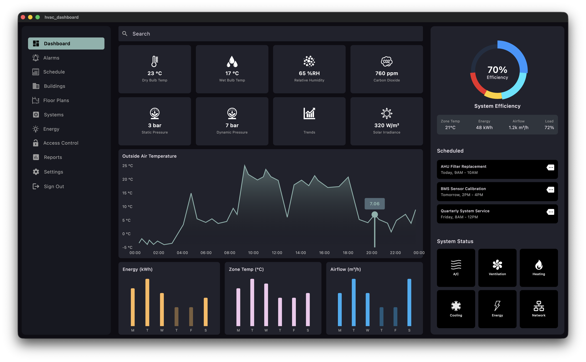
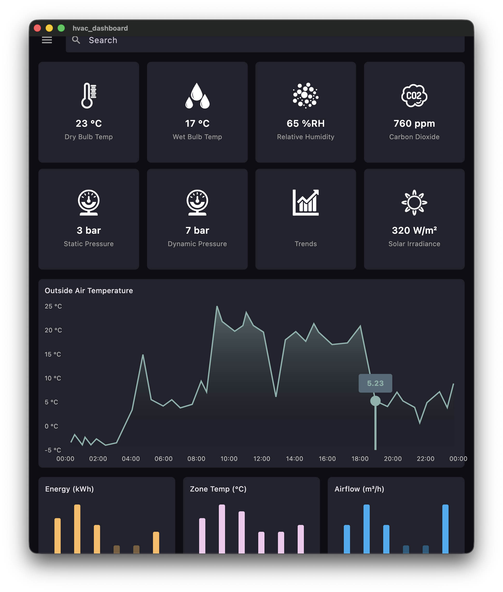
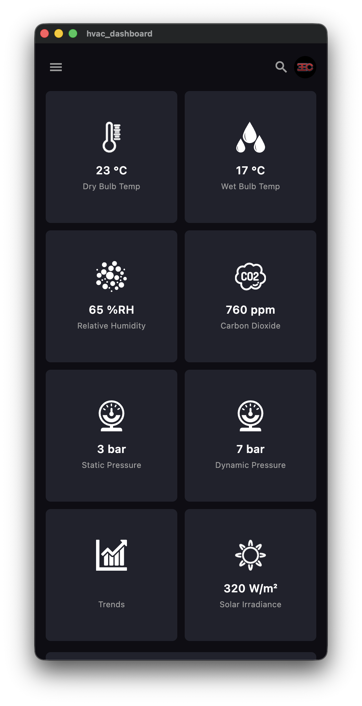

# 3EC HVAC Dashboard

<p align="center">
  
</p>

<p align="center">
  <strong>Responsive HVAC/BMS dashboard UI built with Flutter</strong><br/>
  Interface concept and front-end implementation for <a href="https://github.com/3EC-DEVELOPER">Three Energy Control (3EC)</a>
</p>

<p align="center">
  
  
  
  
</p>

## Overview

This repository presents a multi-platform Building Management System dashboard focused on HVAC monitoring, energy visibility, and responsive operator workflows.

It is designed as a front-end showcase rather than a live controls integration. The UI demonstrates how a modern BMS interface can adapt across desktop, tablet, mobile, and web while keeping the information hierarchy clear and usable.

## What This Shows

- Responsive Flutter layout across desktop, tablet, mobile, and web
- HVAC-oriented metrics, trends, and summary panels
- Custom SVG icon set for plant, energy, ventilation, and infrastructure states
- Dashboard composition aimed at portfolio/demo use rather than template output
- A single codebase that can be taken across multiple Flutter targets

## Screenshots

### Desktop

Three-column operator layout with navigation, dashboard content, and system summary.



### Tablet

Condensed two-column layout with summary content brought inline below the main dashboard.



### Mobile

Single-column navigation pattern with drawer access and stacked dashboard content.



## Feature Highlights

- HVAC metric cards covering dry bulb, wet bulb, humidity, CO2, pressure, and irradiance
- Outside air temperature line chart for quick trend reading
- Weekly comparison charts for energy, airflow, and zone temperature
- System efficiency donut chart for overall load visibility
- Summary strip for fast-glance operating values
- Scheduled maintenance panel for service-oriented dashboard use
- System status icon grid for core plant and network conditions

## Layout Behaviour

| Breakpoint | Layout |
|---|---|
| Desktop `>= 1100px` | Sidebar, dashboard, and summary in a three-column layout |
| Tablet `>= 850px` | Main dashboard with summary content stacked inline |
| Mobile `< 850px` | Drawer-based navigation with a single-column dashboard flow |

## Platform Targets

| Platform | Status |
|---|---|
| macOS | Configured |
| Windows | Configured |
| Linux | Configured |
| Android | Configured |
| iOS | Configured |
| Web | Configured |

## Stack

| Package | Use |
|---|---|
| [Flutter](https://flutter.dev) | Cross-platform UI framework |
| [fl_chart](https://pub.dev/packages/fl_chart) | Charts for trend, bar, and donut visualisations |
| [flutter_svg](https://pub.dev/packages/flutter_svg) | SVG rendering for the icon library |

## Getting Started

### Prerequisites

- Flutter SDK `3.41.x`
- Dart SDK `3.11.x`

### Run Locally

```bash
git clone https://github.com/3EC-DEVELOPER/flutter_projects-3EC-hvac_dashboard.git
cd flutter_projects-3EC-hvac_dashboard
flutter pub get

flutter run -d macos
flutter run -d windows
flutter run -d linux
flutter run -d chrome
flutter run -d ios
flutter run -d android
```

## Project Structure

```text
lib/
├── const/          Shared colours and constants
├── data/           Static dashboard data sources
├── model/          Lightweight view models
├── screens/        Top-level responsive screen layout
├── util/           Breakpoint helpers
└── widgets/        Dashboard components and panels
```

## Positioning

This project is intended to show how BMS/HVAC software can feel cleaner, more visual, and more contemporary than the industry norm while still presenting practical operational information.

## Usage

Copyright © 2026 Three Energy Control Ltd. All rights reserved.

This repository is shared for demonstration and portfolio purposes. It is not licensed for reuse, redistribution, or commercial deployment without prior written permission.
